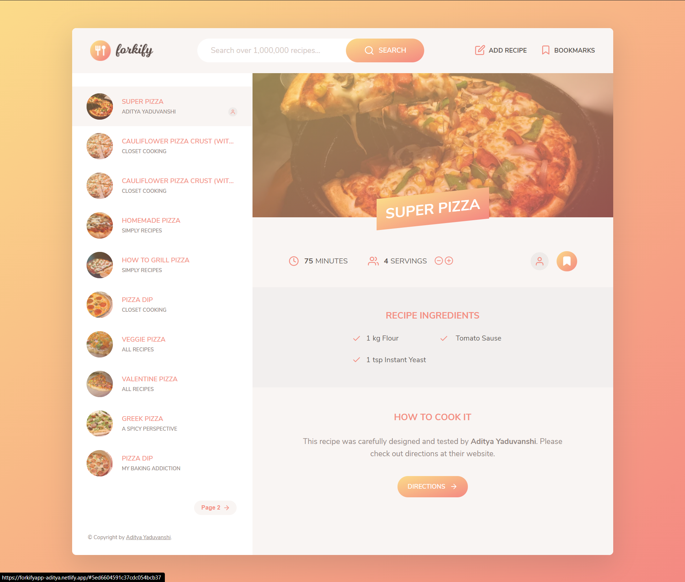

# Forkify Project
Recipe application with custom recipe uploads. 

## About the project
Description: Forkify is a JavaScript project which is powered by food2fork API delivering great recipes and featuring users to add the recipe ingredients to their shopping list.

The app uses modern JavaScript tools and dependencies like Babel, Webpack, and other 3rd party libraries. The user can like and save the recipes in a liked list which is then saved to browser's local storage which can be accessed throughout the browsing session.

Application Features:
• Search over 1000 recipes for directions and ingredients
• Save recipes to liked items and can be accessed later
• Add ingredients to shopping cart and refactoring count, unit, and ingredient data.

Technical Skills:
Language: JavaScript, HTML, CSS
Tools: VS Code, Node.js, Express.js, Babel, Webpack

## Link to website
   Live Demo - https://forkifyapp-aditya.netlify.app/

## Screenshot 

##  Features
<ol>
  <li> Search over 1000 recipes for directions and ingredients</li>
  <li>Save recipes to liked items and can be accessed later</li>
  <li>Show workouts on map</li>
<li>Add ingredients to shopping cart and refactoring count, unit, and ingredient data.</li>
  <li>Saving bookmarks to localstorage</li>
</ol>

## Technical Skills used
<ul>
  <li>Language: Javascript,HTML,CSS</li>
  <li>Tools: VS Code, Node.js, Express.js, Babel, Webpack</li>
  
  </ul>
  
  
## Contact me
<ul>
  <li>Created by Aditya Yaduvanshi</li>
  <li>Twitter -- <a href="https://twitter.com/fixslyr">Fixslyr</a>
    <li>Instagram -- <a href="https://www.instagram.com/imtheaddy/">Aditya Yaduvanshi</a>
      <li>Linkedin -- <a href="https://www.linkedin.com/in/theaditya-yaduvanshi-/">Aditya Yaduvanshi</a>
  </ul>    
      

